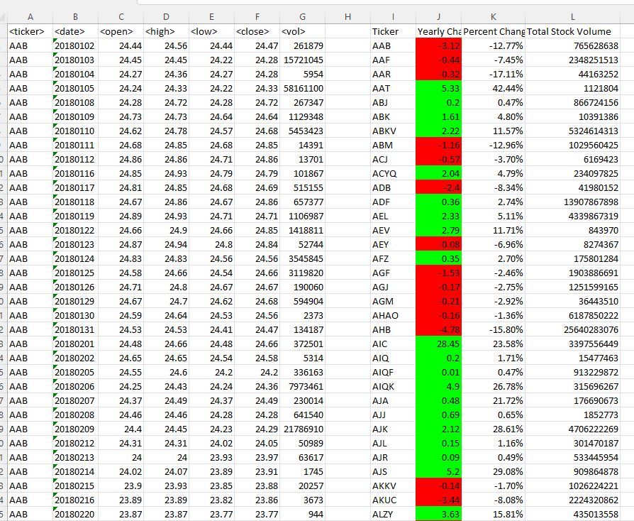
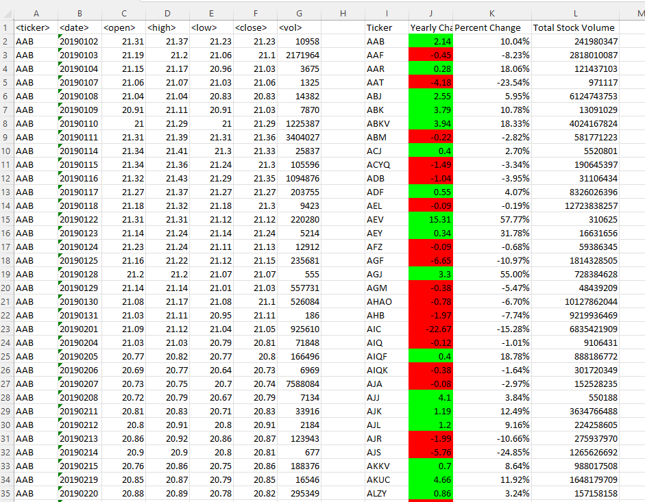
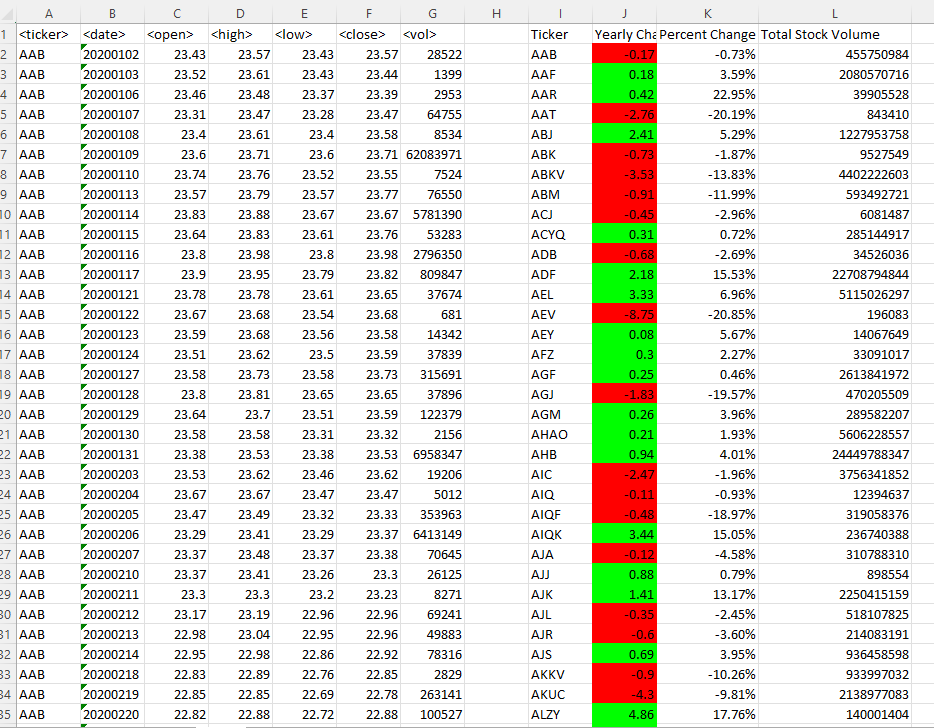

# VBA-Challenge 

## Overview

Stock Market Analysis
This project is designed to evaluate stock market values on a wide data set through multiple years using vba script. 
VBA script is attached to this repository as well as screenshots of the successful code.
This project determines the proficiency of the user in VBA script. 

## Analysis

## Results
### 2018

  

### 2019

### 2020
  

